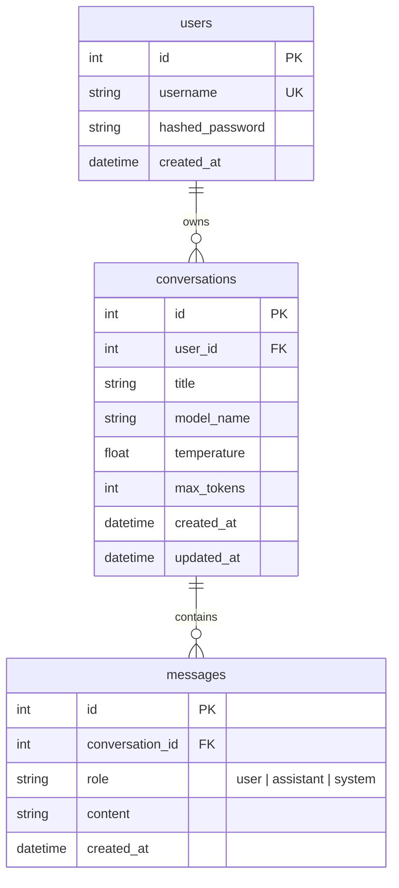

# Local AI Inference Management System

An elegant, secure, and fully local LLM chat coordinator that pairs a high-performance **FastAPI backend** with a sleek **Vanilla JS/CSS frontend**. The application integrates directly with a local **Ollama** daemon for text generation, using **SQLite** for persisting users, conversations, and detailed message histories.

---

## 🚀 Key Features

* **Complete Local Privacy:** No external APIs or third-party tracking. All inference and database storage occur entirely on your local machine.
* **FastAPI Backend:** Built with asynchronous endpoints, SQLite database management via SQLAlchemy ORM, and Pydantic configuration schemas.
* **User Authentication:** Robust authentication system securing user dashboards with JWT tokens and salted password hashing (Bcrypt).
* **Ollama Integration:** Automatically detects and displays your locally pulled LLMs (e.g., Llama 3, Mistral, Gemma).
* **Configurable Inference Parameters:** Real-time settings panel adjustments for:
  * **Temperature:** Control the creativity vs. determinism of response outputs.
  * **Max Length:** Configure token budget limits per completion request.
* **Streaming Responses:** Smooth, real-time message streaming using Server-Sent Events (SSE).
* **Modern Premium Frontend:** Featuring interactive sidebar history, markdown parsing via `marked.js`, shimmer loading animations, toast notifications, and dark-themed glassmorphism.

---

## 📂 Project Structure

```text
├── backend/
│   ├── app/
│   │   ├── routes/              # API Route Handlers (auth, chat, models)
│   │   ├── services/            # Business Logic (JWT token verification, Ollama proxy)
│   │   ├── config.py            # Environment-aware configuration settings
│   │   ├── database.py          # SQLAlchemy SQLite connector & connection pooling
│   │   ├── main.py              # FastAPI Application entry point and CORS setup
│   │   └── models.py            # SQLite tables mapping (Users, Conversations, Messages)
│   ├── requirements.txt         # Backend Python dependencies
│   └── chats.db                 # Autogenerated SQLite database (ignored in git)
│
├── frontend/
│   ├── css/
│   │   └── styles.css           # Custom-built modern CSS layout design
│   ├── js/
│   │   ├── api.js               # API Request hooks and SSE streaming handler
│   │   ├── app.js               # Dashboard & messaging event logic
│   │   └── auth.js              # Authentication management (login/register/logout)
│   ├── index.html               # Chat workspace dashboard layout
│   ├── login.html               # Sleek login page interface
│   └── register.html            # Registration page interface
│
└── .gitignore                   # Configured to protect secrets, venv, and databases
```

---

## 🛠️ Prerequisites

Before launching the project, make sure you have:
1. **Python 3.10 or higher** installed.
2. **Ollama** installed and running on your local machine.
   * [Download Ollama here](https://ollama.com/)
   * Pull your desired models (e.g., Llama 3: `ollama pull llama3`)
   * Verify the Ollama daemon is running at `http://localhost:11434`

---

## ⚙️ Getting Started

### 1. Set Up the Backend
1. Open a terminal and navigate to the project directory.
2. Create and activate a python virtual environment:
   ```bash
   # Create environment
   python -m venv .venv

   # Activate on Windows (PowerShell)
   .venv\Scripts\Activate.ps1
   # Or on Windows (CMD)
   .venv\Scripts\activate.bat
   # Or on macOS/Linux
   source .venv/bin/activate
   ```
3. Install the required Python packages:
   ```bash
   pip install -r backend/requirements.txt
   ```
4. Start the FastAPI development server:
   ```bash
   cd backend
   uvicorn app.main:app --reload
   ```
   The backend API documentation will be available at `http://127.0.0.1:8000/docs`.

### 2. Launch the Frontend
Since the frontend uses standard browser modules and communicates with the FastAPI server on port `8000`, it should be hosted locally to avoid CORS or storage issues.

You can serve the `frontend/` directory using Python's built-in HTTP server:
```bash
# Navigate to the frontend directory
cd frontend

# Start a lightweight local server
python -m http.server 5500
```
Now, open your browser and navigate to `http://localhost:5500/login.html`.

---

## 📊 Database Schema



---

## 📜 License
Distributed under the MIT License. See `LICENSE` for more information (if applicable).
